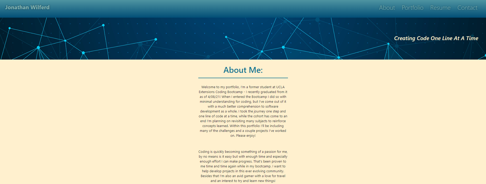
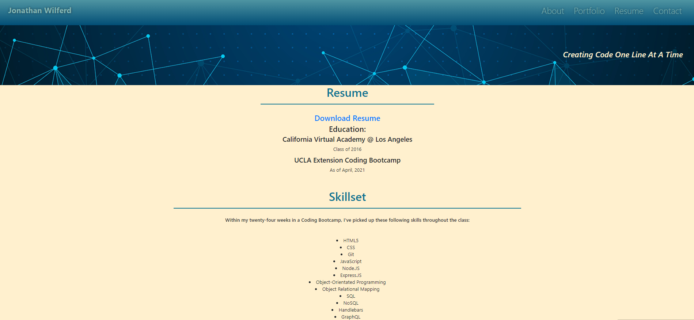

# ✨Jonathan's React Portfolio!✨

:computer: **Live Deployment:** https://damp-reaches-66671.herokuapp.com/#/

:computer: **Github Repo:** https://github.com/jwilferd10/Wilferd-React-Portfolio

## :open_file_folder: Table of Contents :
  - [Preview](#camera-preview)
  - [Description](#description)
  - [User Story](#book-user-story)
  - [Resources Used](#floppy_disk-resources-used)
  - [Installation](#minidisc-installation-and-usage)
  - [Contact Information](#e-mail-contact-information)

## :camera: Preview:

### Homepage:

### Saved Books:

### Demo:

## Description:

 I took a fully functioning Google Books API search engine built with a RESTful API, and refactored it to be a GraphQL API built with Apollo Server. The app was built using the MERN stack, with a React front end, MongoDB database, and Node.js/Express.js server and API. It was already set up to allow users to save book searches to the back end. 

 These are the following changes done: 

1) Set up an Apollo Server to use GraphQL queries and mutations to fetch and modify data, replacing the existing RESTful API.

2) Modify the existing authentication middleware so that it works in the context of a GraphQL API.

3) Create an Apollo Provider so that requests can communicate with an Apollo Server.

 Funny enough this is my second attempt trying to get this Search-Engine to work. Originally in my first attempt I ran into a heap of issues then left the project to work on another. After coming back to this project I grew so confused and did not understand where I left off, primarily because of a lack of comments. Because of the mass confusion I decided it'd be better to start the challenge from scratch and retrace my steps on how I set everything up. That made the work process much easier, but I still ran into problems trying to get my Search Engine up and running. Thankfully I was able to sidestep these issues and got everything working! So please, enjoy the Book Search Engine 3000! 

## :book: User Story:
**AS AN employer looking for candidates with experience building single-page applications**
- I WANT to view a potential employee's deployed React portfolio of work samples
- SO THAT I can assess whether they're a good candidate for an open position

**GIVEN a single-page application portfolio for a web developer**
- WHEN I load the portfolio
  - THEN I am presented with a page containing a header, a section for content, and a footer
- WHEN I view the header
  - THEN I am presented with the developer's name and navigation with titles corresponding to different sections of the portfolio
- WHEN I view the navigation titles
  - THEN I am presented with the titles About Me, Portfolio, Contact, and Resume, and the title corresponding to the current section is highlighted
- WHEN I click on a navigation title
  - THEN I am presented with the corresponding section below the navigation without the page reloading and that title is highlighted
- WHEN I load the portfolio the first time
  - THEN the About Me title and section are selected by default
- WHEN I am presented with the About Me section
  - THEN I see a recent photo of the developer and a short bio about them
- WHEN I am presented with the Portfolio section
  - THEN I see titled images of six of the developer’s applications with links to both the deployed applications and the corresponding GitHub repository
- WHEN I am presented with the Contact section
  - THEN I see a contact form with fields for a name, an email address, and a message
- WHEN I move my cursor out of one of the form fields without entering text
  - THEN I receive a notification that this field is required
- WHEN I enter text into the email address field
  - THEN I receive a notification if I have entered an invalid email address
- WHEN I am presented with the Resume section
  - THEN I see a link to a downloadable resume and a list of the developer’s proficiencies
- WHEN I view the footer
  - THEN I am presented with text or icon links to the developer’s GitHub and LinkedIn profiles, and their profile on a third platform (Stack Overflow, Twitter)

## :floppy_disk: Resources Used:
    Main Resources:
    "@testing-library/jest-dom": "^5.11.9",
    "@testing-library/react": "^11.2.5",
    "@testing-library/user-event": "^12.8.3",
    "bootstrap": "^4.6.0",
    "react": "^17.0.1",
    "react-bootstrap": "^1.5.2",
    "react-dom": "^17.0.1",
    "react-router-dom": "^5.2.0",
    "react-scripts": "4.0.3",
    "web-vitals": "^1.1.1"
    
    Main Resources:
    "if-env": "^1.0.4"

## :minidisc: Installation and Usage:
Install this project by clicking the *GREEN* button above, you can download it by ZIP or copy the SSH! Then you'll want to run it by doing npm i, then npm start. Then:
- Make sure mongod is up and running
- npm start
- Browse through portfolio

## :e-mail: Contact Information:
- ### [jwilferd10](https://github.com/jwilferd10)
